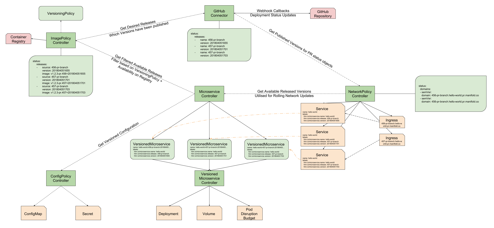

# Heighliner Design Decisions

Heighliner has a number of moving parts. In the documents listed below, we'll
describe our design decisions regarding these moving parts and explain what each
component does and why we've architected it this way.

- [Microservice](./microservice.md)
- [Versioned Microservice](./versioned-microservice.md)
- [Image Policy](./image-policy.md)
- [Versioning Policy](./versioning-policy.md)
- [GitHub Connector](./github-connector.md)
- [Config Policy](./config-policy.md)
- [Network Policy](./network-policy.md)
