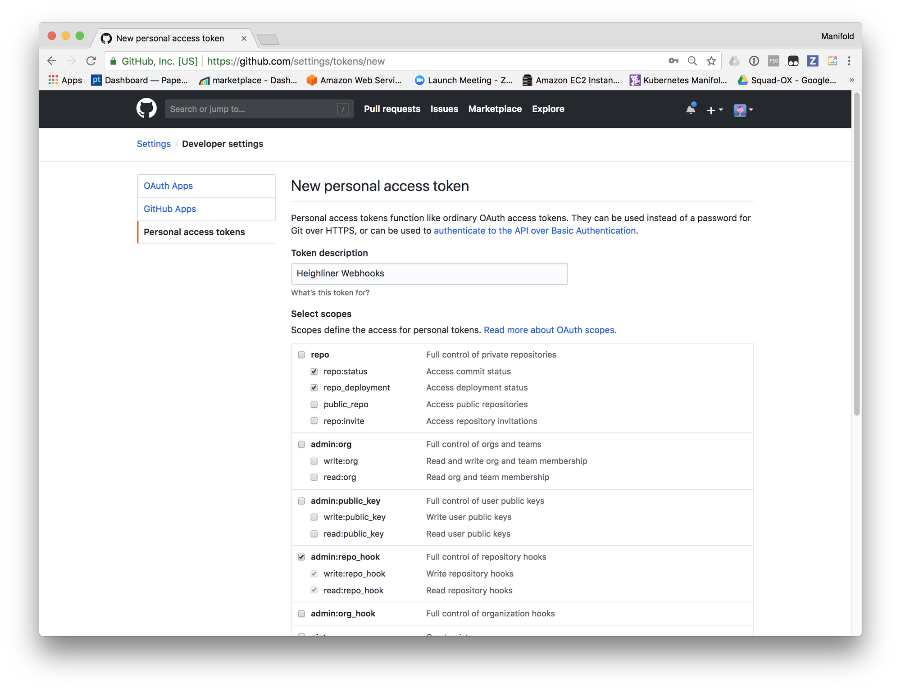

# GitHub Connector

The GitHub connector is an essential part in the workflow pipeline. It's the
part that knows about what releases are available on GH and which Pull Requests
have been opened.

To do this, there is a CRD installed which allows you to specify a repository
and credentials to connect to this repository. The connector will configure the
appropiate webhooks with this repository to get callback information based on
Release and PullRequest events.

The connector also takes care of setting up a callback server, allowing GitHub
to send these events to the cluster. Once a new Release or PullRequest is
detected, it will be stored accordingly to the associated GitHub Repository CRD.

Lastly, the connector also monitors the NetworkPolicies. These policies indicate
which Microservices have associated releases. If these releases are Preview
releases, the connector will create Deployment objects and link the generated
URL from the NetworkPolicy.

## Installation

To install the GitHub connector, there's a few steps required, these are listed
below.

### API Token

First, an API token will be needed if a CRD is set up. This [GitHub API Token](https://github.com/settings/tokens)
should have the `admin:repo_hook` and `repo` permissions. Once you have a token
you can manually add it to your secrets in development in the namespace that
your app expects. The expected token key is `GITHUB_AUTH_TOKEN`.

This Token is only needed when installing a new GitHubRepository as it is
repository bound.

To install a token, go to the [GitHub Personal Access Tokens](https://github.com/settings/tokens) page.



On the next page, you'll see the API token, this will be in the format of
`888fe32217e96eaaa0709c37a488fd4a457015eb`.

With this token, you can now generate a new Kubernetes Secret:

```
$ kubectl create secret generic github-auth-token --from-literal=GITHUB_AUTH_TOKEN=888fe32217e96eaaa0709c37a488fd4a457015eb
```

This will put the secret in your cluster in a format Heighliner understands. You
can now use `github-auth-token` as a reference to the secret.

*Note*: this needs to be installed in the namespace where you install the
GitHubRepository.

### Domain

The connector needs a domain to start with. In your production or cloud cluster,
this would be a domain you will link to your service and set up in [the Ingress](https://github.com/manifoldco/heighliner/blob/90e33f43b6b61e6aca2e3d68e3452d762887def5/docs/kube/github-policy.yaml#L98)
and [Deployment](https://github.com/manifoldco/heighliner/blob/90e33f43b6b61e6aca2e3d68e3452d762887def5/docs/kube/github-policy.yaml#L59).
In development, we recommend you use [ngrok](https://ngrok.com/) to set up a tunnel.
