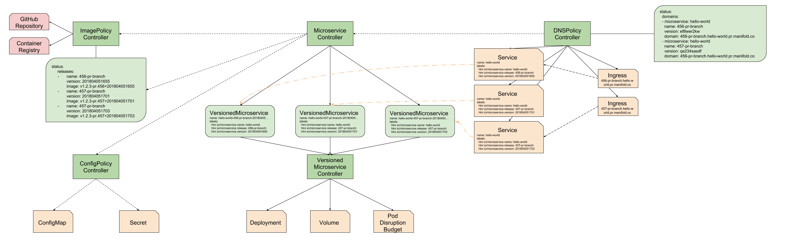

# Microservice

## Custom Resource Definition

The Microservice CRD is responsible for defining what components make a
Microservice.

## Controller

The Microservice controller is responsible for creating a set of
VersionedMicroservices. These VersionedMicroservices depend on available
releases, which are defined by the [ImagePolicy](./image-policy.md) and
[ConfigPolicy](./config-policy.md).

For each new Release or Configuration, the Microservice will create a new
VersionedMicroservice and annotate it appropriately. These annotations are
important so we can use them in other parts of the system.

The Microservice Controller also takes care of deleting deprecated versions from
the system. It does this by looking at which releases should be deployed and
which ones are currently deployed. If there are versions available that
shouldn't be released anymore, it will delete them.

