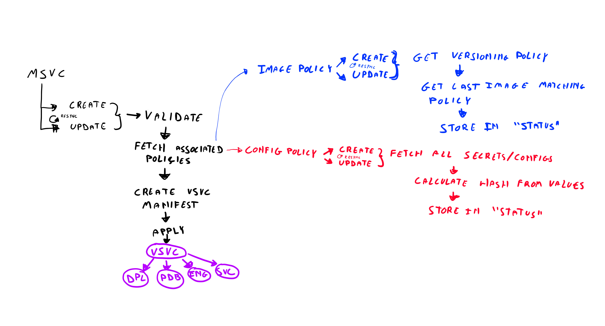

# Microservice

## Custom Resource Definition

The Microservice CRD is responsible for defining what components make a
Microservice.

## Controller

The Microservice controller is responsible for using the CRD and reconsiling the
current state with the desired state. We'll use the standard CRD watcher
resync period to do the reconciliation with the rest of the polices.

Both the `Create` and `Update` actions will use the same pattern. It will fetch
the data from the associated policies and generate a VersionedMicroservice from
this.

These policies can either be static policies or dynamic policies. For the static
policies, we'll fetch the data as is. For the dynamic policies, we'll use the
data stored in the `status` of said policy.

